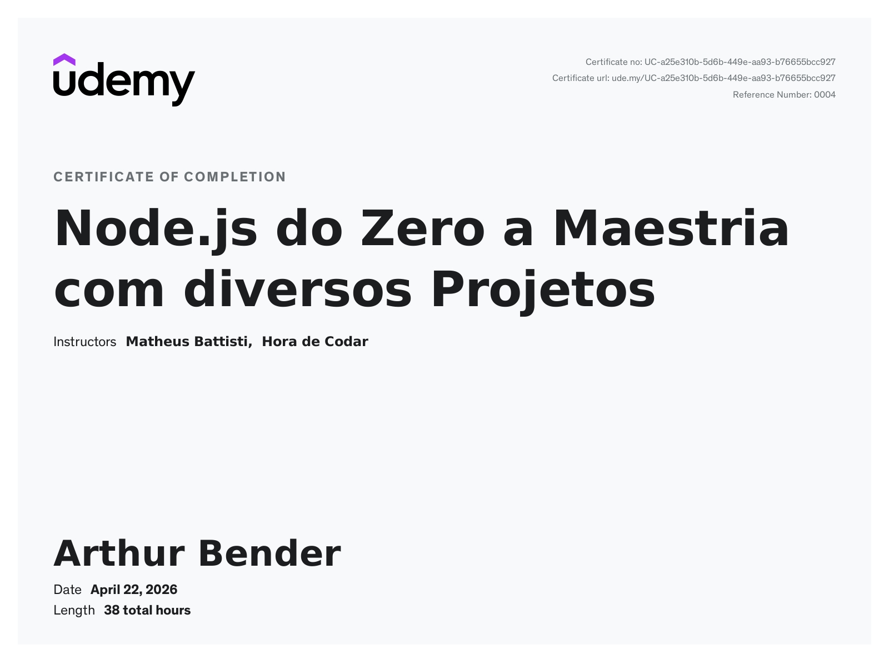

# 📗 Node.js Course Archive

This repository serves as an **archive of my progress** through the Udemy course **Node.js do Zero a Maestria com Diversos Projetos**. It is not a tutorial, but a record of the topics and exercises I completed throughout the course.

---

## ⭐ Section 01 — Introduction to Node.js

Introduces the basics of Node.js, including running simple scripts, printing output to the console, and reading files from the filesystem.

## 🔧 Section 02 — Core Concepts, Modules, npm & CLI Interaction

Covers Node.js fundamentals such as CommonJS and ES modules, command-line arguments, user input, async vs sync execution, error handling, events, and working with external npm packages.

## 📁 Section 03 — Built-in Modules, Filesystem & HTTP Server Basics

Explores native Node.js modules like `fs`, `path`, `os`, and `url`, along with file and directory operations, form handling, and creating basic HTTP servers with manual routing.

## 📦 Section 04 — Working with External npm Modules

Shows how to install and use third-party packages from npm to extend Node.js applications with ready-made utilities.

## 💰 Section 05 — CLI Banking App with Filesystem Persistence

Builds a terminal-based banking project using `inquirer`, `chalk`, and the filesystem to create accounts and perform simple balance operations with persisted JSON data.

## 🚀 Section 06 — First Express Apps, Middleware & Routing

Introduces Express.js by covering middleware, static files, body parsing, routers, template delivery, and basic navigation between pages and routes.

## 🖼️ Section 07 — Express Handlebars & Dynamic Server Rendering

Demonstrates server-side rendering with Express Handlebars, including layouts, partials, dynamic views, and a small product showcase project.

## 🗄️ Section 08 — MySQL Integration & SQL CRUD

Teaches how to connect Node.js applications to MySQL and perform CRUD operations using SQL queries in a book management project.

## 🧠 Section 09 — Sequelize ORM & Model Relationships

Introduces Sequelize for working with relational data through models, validations, and associations, including a users-and-addresses application.

## 🧱 Section 10 — MVC Architecture with Express & Sequelize

Focuses on organizing backend code with the MVC pattern by building a task management app with controllers, routes, models, and views.

## 🔐 Section 11 — Authentication, Sessions & Full CRUD App

Expands into user authentication, password hashing, sessions, flash messages, protected routes, and a complete thoughts-sharing project with dashboard management.

## 🍃 Section 12 — MongoDB with Native Driver

Explores MongoDB integration using the official driver, applying CRUD operations and a model-style structure to manage products.

## 🌿 Section 13 — MongoDB with Mongoose

Builds on the MongoDB section by introducing Mongoose schemas, models, and cleaner data handling for a product CRUD application.

## 🔌 Section 14 — REST API Fundamentals with Express

Shows how to create a JSON API with Express, validate request bodies, define endpoints, and test requests in a simple product API project.

## 🛒 Section 15 — Full-Stack OLX-Style Marketplace Project

Brings together backend and frontend concepts in a larger marketplace application, including authentication, image uploads, item management, trade flow, REST endpoints, and a React + TypeScript frontend.

---

